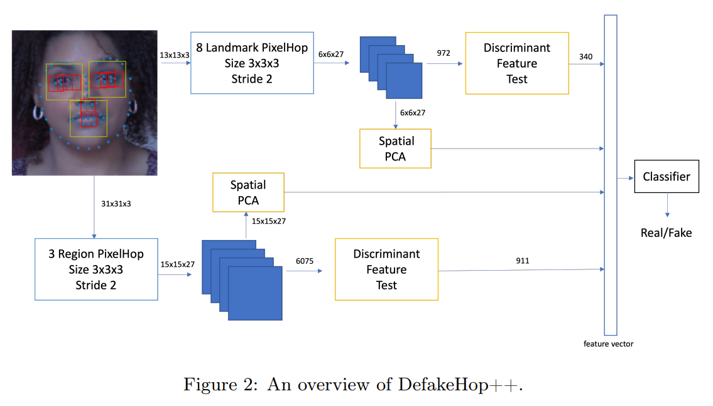
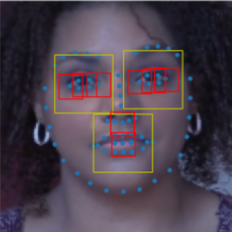

# DefakeHop++: An Enhanced Lightweight Deepfake Detector

---

# What is DefakeHop++?

## Enhanced Detector
- Improved version of DefakeHop.

## Improvements
- **Facial Landmarks:** From 3 to 11 landmarks.
- **Feature Selection:** Uses Discriminant Feature Test (DFT) for supervised selection.

---

# DefakeHop++ System Overview

1. Pre-processing Step
2. One-Stage PixelHop
3. Spatial PCA
4. Discriminant Feature Test (DFT)
5. Classifier

---

# DefakeHop++ System Overview

---

# Pre-processing Step

## Frame Extraction
- Extract frames from video sequences (e.g., 3 frames per second).

## Facial Landmark Detection
- Use OpenFace2 to detect 68 landmarks.

## Block Extraction
- Crop and resize facial regions and landmarks (e.g., 128x128 pixels).

---

# cropping

- crop sizes are hyper-parameters
- 3 big blocks (yellow) and 8 small blocks (reds)

---

# One-Stage PixelHop

## Description
- Data-dependent filter bank creation using the **Saab transform**.

## Feature Extraction
- Decompose patches into DC and AC components, focusing on high-energy features.

---

# Spatial PCA

## Purpose
- Remove spatial correlations in feature components.

## Method
- Apply PCA to each channel, retaining leading components up to 80% of total energy.

---

# Discriminant Feature Test (DFT)

## Supervised Selection
- Optimize feature selection using training labels by minimizing cross-entropy.

## Process
- Split feature intervals at various positions, evaluate cross-entropy, select best split.

---

# Classification

## Classifier
- Use **LightGBM**, a gradient boosting framework, for final classification.

## Features
- Integrate features from various facial regions and landmarks.

---

# Experimental Results

## Datasets
- Evaluation on UADFV, FaceForensics++, Celeb-DF, DFDC.

## Performance Metrics
- Comparison of AUC scores, model size, training time.

---

# Key Findings

## Comparison with MobileNet v3
- Higher detection performance with significantly smaller model size (238K parameters vs. 1.5M).

## Training Efficiency
- Lower training time and computational requirements, suitable for mobile deployment.

---

# Conclusion and Future Work

## Summary
- DefakeHop++: Lightweight, high-performance Deepfake detector for mobile devices.

## Future Directions
- Extend to other fake image types (e.g., satellite images, spliced photos).
- Explore lightweight, weakly-supervised solutions for evolving Deepfake techniques.