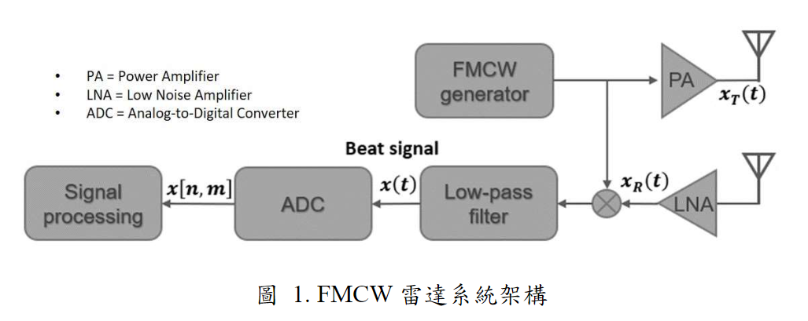
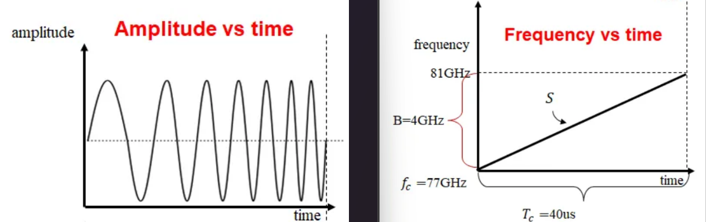
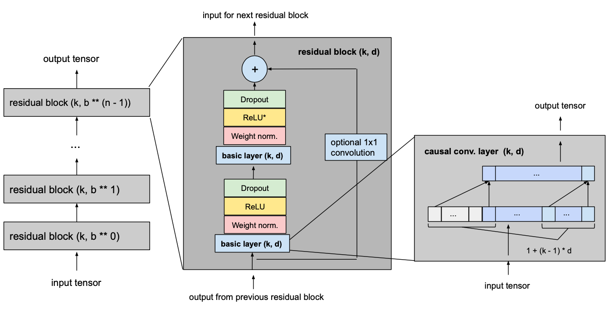

# 基於時序卷積網路之單FMCW雷達應用於非接觸式即時生命特徵監控 

---

## 緒論

市面上有許多監測心率及呼吸率的產品，依監測方式可分為接觸式及非接觸式兩種。
接觸式裝置的精確度通常較非接觸式來得高，然而也會有長期穿戴不適等問題。

#### 接觸式
- 智慧手錶/手環、夾式血氧儀

#### 非接觸式
- **無線雷達**、雷射測距儀、熱成像攝影

## 此次研究使用的是**調頻連續波(FMCW)雷達**

---

# 心率/呼吸率提取方法

---
- 資料前處理
  1. FMCW 雷達 ->時域訊號
  2. 時域訊號->Range FFT->頻域訊號 
  3. 頻域訊號->靜態雜波濾除->動態物體頻率與距離
  4. 用拍頻訊號之相位差提取心率及呼吸率
- 時序卷積網路
- Transformer Encoder
- Regressor

---

# 調頻連續波雷達 Frequency Modulated Continuous Waveform Radar

---

---

## 連續調變波

- 應用鎖相迴路（Phase-Locked Loop，PLL）作為訊號產生器。
- 透過不斷調整 PLL 裡的壓控振盪器(Voltage-Controlled Oscillator, VCO) 的頻率來生成頻率連續調變的信號

---

---

## 訊號表示

- 發射訊號:  $x_T(t) = A_T\cos(2\pi f_T(t)t + \Phi_T(t))$, $A_T$為發射的傳輸能量大小
- 接收訊號:  $x_R(t) = A_R\cos(2\pi f_R(t)t + \Phi_R(t))$, $A_R$為接收的傳輸能量大小

#### 我們將 LNA 加強後的訊號與發射訊號做混頻處理，經過混頻後的訊號稱為拍頻訊號

- 拍頻訊號: $x_T(t) \cdot x_R(t) = A_T\cos(2\pi f_T(t)t + \Phi_T(t)) \cdot A_R\cos(2\pi f_R(t)t + \Phi_R(t))$

#### 將混頻完的訊號取低頻部分，即為我們所需的基頻訊號

- 基頻訊號: 
  $$x(t) = \frac{1}{2}A_TA_R \cdot \cos (2\pi (f_T(t)-f_R(t))t + (\Phi_T(t) - \Phi_R(t)))$$
  $\qquad\qquad\quad\ = A\cos (2\pi f_b(t)t + \Phi_b(t)t)$. $\Phi_b$為拍頻訊號相位隨時間的變化

---

## 數位訊號處理器

**將類比訊號取樣來獲得數位訊號**

- 取樣表示
  $$x[n, m] = A\cos (2\pi f_b(nT_f+mT_s)nT_f + \Phi_b(nT_f+mT_s))$$

- $T_f$ 快速時間 (Fast-time): 針對每個 chirp 裡的時間做取樣
- $T_s$ 慢速時間 (Slow-time): 針對不同 chrip 之間的時間間隔做取樣

---

## 距離推導

FMCW 雷達發射訊號的頻率會隨著時間變化，假設一個 chirp 的起始頻率為$f_s$、截止頻率為$f_e$、週期為$T_s$、頻寬為$B$、斜率為$S$，則可以表示成以下式子: 

- $B = F_e-F_s$
- $S = \frac{B}{T_s}$

毫米波以光速$C$傳遞，因此可以透過前面得到的拍頻訊號經由下式推導出距離$d(t)$

- $t_d = \frac{2d(t)}{C}$
- $f_b = St_b = \frac{B}{T_s} \cdot \frac{2d(t)}{C}$

一維快速傅立葉轉換將協助我們取得$f_b$, 從而算得$2d(t)$。

---

## 一維快速傅立葉轉換 Range FFT

我們得到經取樣過的拍頻訊號後，將每一個快速時間取樣點做 Range FFT，經過 FFT 的表示如下:

$$X_m[K] = \sum^{N-1}_{n=0}x[n,m]e^{-j\frac{2\pi nk}{N}}, k = 0, ..., N-1$$

其中 $K$ 為 FFT 指標(index)，$N$ 為每個 chirp 裡的取樣數。當第 $K$ 個達到最大值時，即可透過距離分辨率換算物體距離。其換算的公式如下:

$$d = \frac{t_d\cdot C}{2} = f_bT_c\cdot \frac{C}{2B}$$

其中$C=3\times 10^8$為光速，$B$為 chirp 之頻寬。 $\frac{C}{2B}$定義為距離分辨率。

---

## 靜態雜波濾除 Clutter removal

- 利用平滑處理來濾出環境中的靜態背景物件
  
$$X'_m[k] = \sigma X_m[k]+ (1-\sigma )X_{m-1}[k], 0\leq \sigma \leq 1$$

- $\sigma$為平滑系數，$\sigma$越大，平滑效果越好，但較多的目標訊號也會被平滑掉；$\sigma$越小，平滑效果越差，較多的靜態雜波會被保留。
- 最後，將平滑處理後的靜態雜波圖與原本未經處理的訊號相減，便能得到濾除靜態雜波後的結果。其表示如下:

$$Y_m[K] = $X_m[k]-X'_m[k]$$

從這些$Y_m[K]$找出最大值的頻率，結合推導的距離分辨率便能計算出物體距離，其表示如下: 

$$k_{\max} = \arg_k\max |Y_m[K]|$$
$$d = f_bT_c\cdot \frac{C}{2B} = k_{\max}\cdot \frac{C}{2B}$$

---

# 時序卷積網路 (Temporal Convolutional Network)

---

## 什麼是時間序列資料?

- 以規律的時間間隔採集的資料 (每1分鐘、每5分鐘)
- 股票價格、天氣資訊、雷達訊號
  
## Why TCN?
- Recurrent Neural Networks (RNN), Long Short-Term Memory (LSTM), Gated Recurrent Unit (GRU)
- 容易梯度消失
---
# TCN 核心概念

1. **因果卷積（Causal Convolution）**：
   - 確保未來的輸入不會影響當前時刻的輸出，即保持時間序列預測中時間順序的正確性。
  
2. **擴張卷積（Dilated Convolution）**：
   - 利用間隔卷積來擴大感受野，而無需增加卷積層的參數數量，這使得模型能夠更有效地處理長時間依賴。

3. **殘差結構（Residual Connections）**：
   - TCN 也引入了殘差結構來幫助減少梯度消失，並改善深層網絡的性能。

---

## 1. 因果卷積 (Causal Convolution)

- 在卷積運算中，標準的卷積核可能會使用到未來的數據（即，當前輸出由未來和過去的數據共同決定），這在時間序列預測中是不合理的。
- 因果卷積的主要目的是保持時間序列的因果性，即確保模型的預測是基於過去的輸入，未來的信息不應影響當前時間點的輸出。
- 在卷積運算過程中，TCN 為了確保因果性，將卷積核向右偏移，這樣模型在預測當前時刻 $t$ 的輸出時，只能看到 $t$ 及之前的輸入。
- 例如，若卷積核的大小為3，對於時間點 $t$，輸出只會依賴於時間點 $t$、$t-1$ 和 $t-2$ 的數據。

- 保證時間順序的一致性，適合需要逐步預測未來狀態的應用。

---

## 2. 擴張卷積 (Dilated Convolution)

- 擴張卷積的核心思想是通過增加卷積核之間的間隔來增大感受野，而不增加卷積層的參數數量。這意味著模型可以觀察更長的歷史數據，從而捕捉長期依賴關係。
- 在時間序列數據中，長期的依賴關係對於預測未來有關鍵影響，但標準卷積的感受野通常較小，無法有效處理這類問題。擴張卷積有效擴展了模型的感知範圍。

- 擴張卷積的公式如下：$y(t) = \sum_{i=0}^{k-1} x(t - r \cdot i) \cdot w(i)$
  其中$x(t)$ 是輸入，$y(t)$ 是輸出，$w(i)$ 是卷積核，$r$ 是擴張率，$k$ 是卷積核大小。擴張率 $r$ 決定了卷積核每次“跳過”的步長。

- 通過逐層增加擴張率 $r$（如1, 2, 4, 8...），TCN 可以用較少的層數捕捉更長時間範圍的依賴，保持計算效率。

---

## 3. 殘差結構 (Residual Connections)

- 殘差結構的引入是為了解決深層網絡在訓練過程中的梯度消失或梯度爆炸問題。當模型變得很深時，信息傳遞到最深的層次可能會變得非常弱，這會導致訓練效率低下。
- 殘差結構通過在每兩層卷積之間直接添加跳連接（skip connection），允許信息以跳躍的方式傳遞，使得梯度在反向傳播時能夠更穩定地傳遞到較淺的層次。

- 殘差結構是由一個標準卷積操作與一個直接加法操作組成：$y(t) = f(x(t)) + x(t)$
  其中，$f(x(t))$ 是卷積操作後的結果，直接與輸入 $x(t)$ 相加。

- 通過這樣的結構，模型學習的是輸入與輸出之間的「殘差」，而不是直接學習輸出本身，這使得模型能夠更快速收斂。

- 在TCN中，這個結構使得模型能夠疊加更多的卷積層來捕捉複雜的時間依賴關係，而不會出現模型退化的情況。

---

---

## 總結

- **因果卷積** 保證了時間序列的正確因果性。
- **擴張卷積** 提供了一種高效捕捉長期依賴的手段，且不會顯著增加模型參數或計算量。
- **殘差結構** 則是深層網絡的關鍵設計，使得訊息能夠有效在層與層之間傳遞

