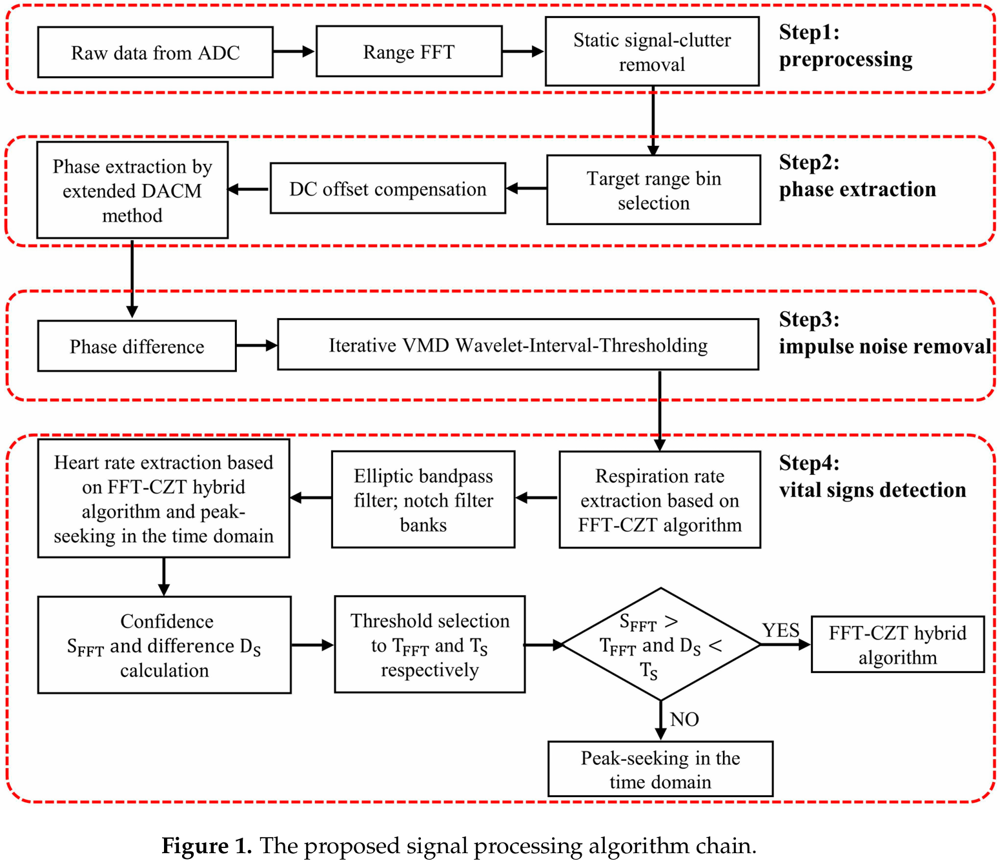
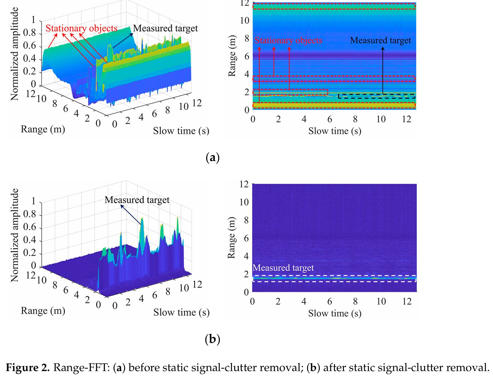
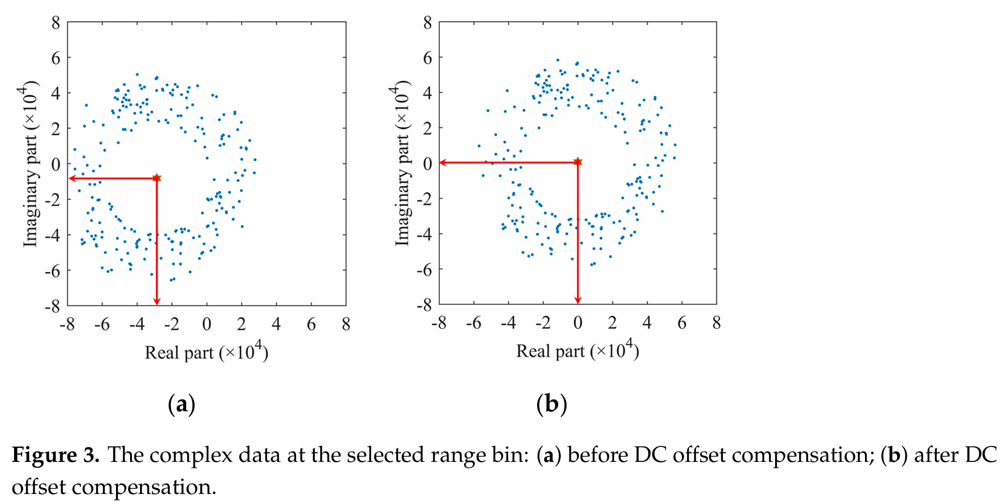
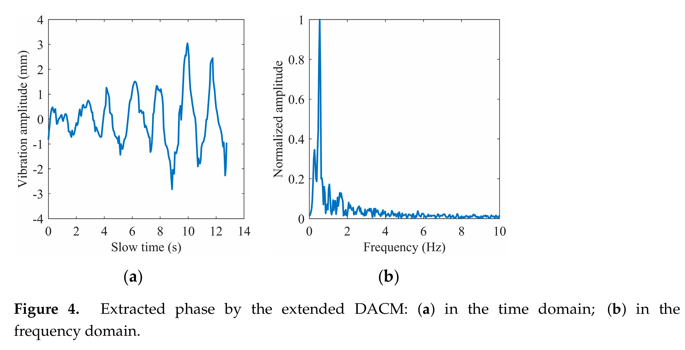
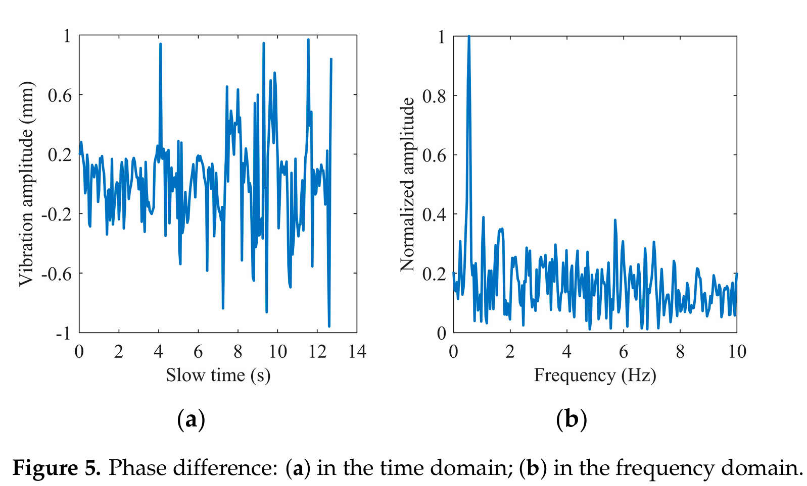
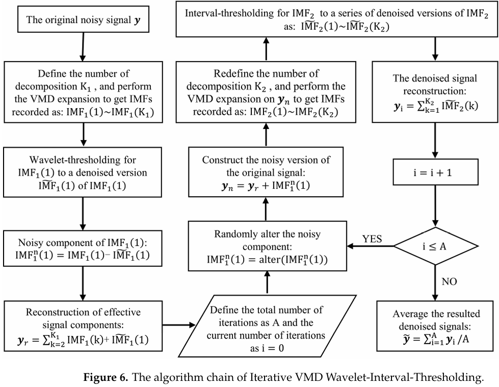
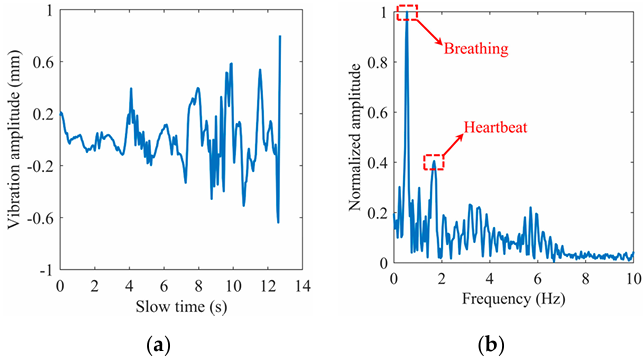
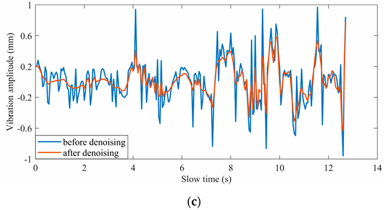

## Why This Research?
- **Non-contact vital sign monitoring** is crucial for:
  - Burn patients, newborns, elderly, and infectious disease monitoring.
  - Applications like home healthcare and driver fatigue detection.
- **Challenges**:
  - Hardware noise → **Low SNR** (signal-to-noise ratio)
  - Extracting small motions like breathing/heartbeat accurately.

---

# Proposed System Overview

---

## FMCW Radar-Based Monitoring System
- **Radar Type**: 77 GHz FMCW millimeter-wave radar.
- **Scenario**: Monitor a person sitting in an office environment.
- **Data Acquired**: 
  - **Respiration rate**
  - **Heart rate**
- **DSP Chain**: Key innovation of the paper.

---

# Signal Processing Chain

---

## Steps in DSP Workflow

1. **Signal Preprocessing**:
   - Static clutter removal (background interference).
   - DC offset compensation (correct hardware bias).
2. **Phase Extraction In Range Window**:
   - Use extended DACM algorithm to extract phase.
3. **Noise Reduction**:
   - Iterative VMD Wavelet-Interval-Thresholding.
4. **Feature Extraction**:
   - Respiration: FFT-CZT hybrid algorithm.
   - Heartbeat: Time-domain peak-seeking & FFT.
5. **Final Output**:
   - Accurate respiration and heart rate with low relative errors.

---

---

# Range FFT and Static Clutter Removal

---
# Range FFT
- Converts radar raw data (in time domain) into frequency domain.
- Identifies the **distance (range)** of targets by analyzing signal frequencies.

# Static Signal Clutter Removal
- Eliminates interference from stationary objects (e.g., walls or furniture).
- Focuses only on signals reflected from moving targets (e.g., human breathing or heartbeat).

---

# Range FFT
### Key Concepts:
- **Radar Signal:** Reflected signals contain time delays proportional to the distance of objects.
- **FFT (Fast Fourier Transform):** Converts the time-delay signal into frequencies to calculate distances.

### Steps:
1. **Raw Data:** Radar captures signals over multiple fast-time intervals.
2. **Apply FFT:** Transforms time-domain data into frequency domain.
3. **Identify Range:** The frequency peaks correspond to the distances (ranges) of objects.

---

# Static Signal Clutter Removal
### Key Concepts:
- Stationary objects (e.g., walls, furniture) cause "clutter" in radar data.
- Moving targets (e.g., human chest movements) create dynamic signals.

##### Method:
$$
y[m,n] = y_0[m,n]-\frac{1}{N_{\text{frames}}}\sum^{N_{\text{frames}}}_{n=1}y_0[m,n]
$$
where $m=1,2,3,...,N_{\text{samples}}; n=1,2,3,...,N_{\text{frames}}$.
$N_{\text{samples}}$ means the number of sampling points of each chirp; and $N_{\text{frames}}$ means the number of frames.

---

# Why Are These Steps Important?
## Range FFT:
- Determines **where** the targets are located (distance).
- Creates the **range bins** for further processing.

## Static Signal Clutter Removal:
- Focuses on **dynamic movements** of interest.
- Improves signal-to-noise ratio (SNR) for vital signs detection.

---

---

# DC Offset Compenstation

### **Definition**
- DC offset is an unwanted constant or low-frequency component in a signal that shifts it away from its baseline (zero level). 
- This offset occurs due to hardware imperfections such as ADC or amplifier imbalance.

### **Purpose**
- Remove the DC component to center the signal around zero.
- Improve analysis of dynamic signal variations caused by respiration and heartbeat.

---

### **Process**
1. **Calculate the DC Component**:
   $$
   \text{DC}_{\text{value}} = \frac{1}{N} \sum_{n=1}^N x[n]
   $$
2. **Subtract the DC Component**:
   $$
   x_{\text{adjusted}}[n] = x[n] - \text{DC}_{\text{value}}
   $$
3. **Result**:
   - Signal is centered around zero, eliminating static bias.

---

---

## **DACM (Differentiate and Cross Multiply)**
### **Definition**
- A method to extract dynamic phase changes from radar signals by focusing on short-term variations and removing static noise.

### **Purpose**
- Isolate dynamic phase signals caused by physiological movements (e.g., breathing, heartbeat).
- Remove static phase noise or low-frequency interference.

---

### **Steps**
1. **Phase Extraction**:
   - Calculate the instantaneous phase from I (in-phase) and Q (quadrature) components:
    $\phi(t) = \tan^{-1} \left(\frac{Q(t)}{I(t)}\right)$
1. **Differential Phase Calculation**:
   - Compute the change in phase over time:
    $\Delta \phi(t) = \phi(t) - \phi(t-1)$
2. **Accumulation**:
   - Reconstruct the dynamic phase signal by accumulating differential values:
    $\phi_{\text{DACM}}(t) = \sum_{k=1}^{t} \Delta \phi(k)$
1. **Filtering**:
   - Apply high-pass filtering to remove residual low-frequency noise.

---

1. $$\begin{equation}\frac{d}{dt} \phi(t) = \frac{d}{dt} \left[ \arctan \frac{Q(t)}{I(t)} \right] = \frac{I(t) Q'(t) - Q(t) I'(t)}{I(t)^2 + Q(t)^2}\end{equation}$$

2. $$\begin{equation}\phi(n) = \sum_{k=2}^{n} \frac{I(k) \left[ Q(k) - Q(k-1) \right] - Q(k) \left[ I(k) - I(k-1) \right]}{I(k)^2 + Q(k)^2}\end{equation}$$

---

We transform the extracted phase into **the waveform of chest vibration amplitude varying with slow time** and obtain **its spectrum information** through FFT.

We found that the heartbeat frequency is covered in the spectrum in ***Figure 4b*** because the chest fluctuation caused by the heartbeat is very weak relative to breath

---

The first-order phase difference operation is adopted to enhance the heartbeat signal. ***Figure 5*** shows the time domain waveform and frequency domain spectrum of the differential signal, where the spectral amplitude in the heart rate range is increased.

---

# Iterative VMD Wavelet-Interval-Thresholding 
 
1. Combines **Variational Mode Decomposition (VMD)** with **Wavelet Interval Thresholding**.  
2. **Goal**: Extract meaningful signals (e.g., heartbeat or breathing signals) from complex data and impulse noise.  
3. Uses an **iterative framework** to improve signal purity.  

---

## Method Overview  

1. **Signal Decomposition (VMD)**  
   - Decomposes the raw signal into multiple modes, corresponding to a different frequency band(**IMFs**).  
2. **Wavelet Thresholding**  
   - Performs wavelet decomposition to obtain approximation and detail coefficients.  
   - Applies adaptive thresholding to suppress noise coefficients.  
3. **Signal Reconstruction**  
   - Combines wavelet coefficients to reconstruct the denoised modes.  
4. **Iterative Processing**  
   - Repeats decomposition and thresholding for further noise suppression.  

---

## VMD Decomposition

- A signal processing technique that decomposes a complex signal into Intrinsic Mode Functions (IMFs), each within a specific frequency band.

### example
1. Original Signal: Includes heartbeat, breathing, and noise components.  
2. Modes Extracted by VMD:  
   - **Mode 1**: High-frequency noise.  
   - **Mode 2**: Breathing signal.  
   - **Mode 3**: Heartbeat signal.  

---

## Wavelet Thresholding

1. Decomposes each mode into wavelet coefficients.  
   - Approximation coefficients: Low-frequency components.  
   - Detail coefficients: High-frequency components (often noise).  
2. Applies adaptive thresholding:  
   - Keeps significant coefficients (signal).  
   - Suppresses coefficients below the threshold (noise).  

---

## Iterative Framework

1. Reconstruct the denoised signal after wavelet thresholding.  
2. Feed the reconstructed signal back into the VMD step.  
3. Repeat the process until noise is minimized and signal clarity improves.  

---

---

# Results

---

# Experiments and Results

---
## Experimental Setup
- **Radar Used**: TI AWR1642 with DCA1000 acquisition board.
- **Subjects**: 11 people, 2 groups.
  - Group 1: Normal respiration & heart rates.
  - Group 2: Accelerated breathing/heart rates.
- **Test Scenarios**: Distances of 0.8m, 1m, 1.3m, 1.5m.

---

## Results
- **SNR Improvement**:
  - Respiration: +1.89 dB.
  - Heartbeat: +1.44 dB.
- **Accuracy**:
  - Respiration: Avg. error = 1.33%.
  - Heartbeat: Avg. error = 1.96%.

---

# Contributions of the Paper

---
## Why This Paper Matters
- Combines FMCW radar with advanced DSP techniques.
- Demonstrates non-contact vital sign monitoring with high accuracy.
- Addresses challenges like:
  - Low SNR.
  - Hardware imperfections.
  - Small motion extraction.
- **Applications**:
  - Healthcare monitoring.
  - Emergency alerts.
  - Home-based elderly care.

---

# Summary and Conclusion

---
## Key Takeaways
- FMCW radar + DSP = High-precision monitoring.
- **DSP Techniques**:
  - Iterative VMD Wavelet-Interval-Thresholding.
  - FFT-CZT hybrid algorithm.
  - DC offset compensation.
- **Results**:
  - Accurate respiration and heart rate monitoring.
  - Applicable in noisy, real-world environments.
- **Future Scope**:
  - Real-time processing.
  - Broader healthcare applications.

